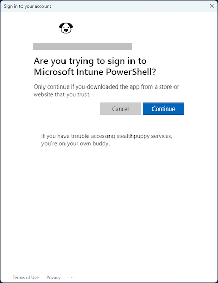

# Importing Packages on Windows

To run the package factory locally, clone the repository to a Windows machine, and install the required PowerShell modules.

## PowerShell Modules

The factory requires that the **MSAL.PS**, **IntuneWin32App**, **Evergreen**, **VcRedist** PowerShell modules are installed. Ensure you have [setup your environment](https://stealthpuppy.com/packagefactory/setup/) before attempting to create packages.

## Authentication

When running the packaging factory locally on Windows to create application packages and import into an Intune tenant, you must first authenticate to the tenant. The user account used to authenticate must be an [Intune Administrator](https://learn.microsoft.com/en-us/azure/active-directory/roles/permissions-reference#intune-administrator) or an [Intune Application manager](https://learn.microsoft.com/en-us/microsoft-365/business-premium/m365bp-intune-admin-roles-in-the-mac).

### Interactive Authentication

Interactive authentication to a tenant can be performed with `Connect-MSIntuneGraph`:

```powershell
Connect-MSIntuneGraph -TenantId stealthpuppylab.onmicrosoft.com
```

This will launch a sign-in window where you can authenticate with an account that has at least the Intune Administrator role. Note that Microsoft Intune PowerShell application is required. Access to this application must be granted by a global administrator.

 

### Authentication via an App Registration

`Connect-MSIntuneGraph` can authenticate to an app registration by passing the tenant ID, application (or client) ID and the client secret:

```powershell
$params = @{
    TenantId     = "6cdd8179-23e5-43d1-8517-b6276a8d3189"
    ClientId     = "60912c81-37e8-4c94-8cd6-b8b90a475c0e"
    ClientSecret = "<secret>"
}
Connect-MSIntuneGraph @params
```

The app registration requires the following API permissions:

| API / Permissions name | Type | Description | Admin consent required |
|:--|:--|:--|:--|
| DeviceManagementApps.ReadAll | Application | Read Microsoft Intune apps | Yes |
| DeviceManagementApps.ReadWriteAll | Application | Read and write Microsoft Intune apps | Yes |

## Parameters

`New-Win32Package.ps1` has several parameters:

- `-Path` - The literal path to the packages directory within the downloaded project. This defaults to the same directory as where `New-Win32Package.ps1` is located
- `-PackageManifest` - The package manifest file name stored in each package directory. This defaults to `App.json` and does not need to be specified
- `-InstallScript` - The template install script file name that will be copied into the package. This parameter does not need to be specified and should not be changed
- `-Application` - An array of application names to import into the target Intune tenant. The application names must match those applications stored in the project
- `-Type` - The package type to import into the target Intune tenant - App or Update. The array passed to Applications must match those application packages defined for this type.
- `-WorkingPath` - Path to a working directory used when creating the Intunewin packages. This defaults to a directory named `output` in the project directory and does not need to be specified; however, you can choose to provide a working directory in an alternative location
- `-Import` - Imports the package into the target Intune tenant. If this switch is not specified, the package will be not be imported
- `Force` - Create the package, even if a matching version already exists.
- `Certificate`- Specifies the certificate that will be used to sign the script or file. Enter a variable that stores an object representing the certificate. Used by Set-AuthenticodeSignature.
- `CertificateSubject` - Specifies the certificate subject name that will be used to sign scripts. Used by Set-AuthenticodeSignature.
- `CertificateThumbprint` - Specifies the certificate thumbprint that will be used to sign scripts. Used by Set-AuthenticodeSignature.
- `TimestampServer`- Uses the specified time stamp server to add a time stamp to the signature. Type the URL of the time stamp server as a string. The URL must start with https:// or http://. Used by Set-AuthenticodeSignature.
- `IncludeChain` - Determines which certificates in the certificate trust chain are included in the digital signature. NotRoot is the default. Used by Set-AuthenticodeSignature.

## Create an Application Package

`New-Win32Package.ps1` is used to read the application package manifest, create the Intune Win32 package and call `Create-Win32App.ps1` to import the package into the target Intune tenant. The value passed to the `-Application` parameter must match a supported application package in the [App directory](https://github.com/aaronparker/packagefactory/tree/main/packages/App).

Here's an example with importing Adobe Acrobat Reader DC and Citrix Workspace app into your Intune tenant by passing an array of package names to the `-Application` parameter:

```powershell
Set-Location -Path "E:\projects\packagefactory"
$params = @{
    Path        = "E:\projects\packagefactory\packages"
    Application = "AdobeAcrobatReaderDCMUI", "CitrixWorkspaceApp"
    Type        = "App"
    WorkingPath = "E:\projects\packagefactory\output"
    Import      = $true
}
.\New-Win32Package.ps1 @params
```

## Create an Update Package

`New-Win32Package.ps1` can also create update packages where an application update is defined. The usage is exactly the same (because the update package logic is stored in the `App.json` for that package) - pass the package name to the `-Application` parameter, but also specify **Update** for the `-Type` parameter. The value passed to the `-Application` parameter must match a supported application package in the [Update directory](https://github.com/aaronparker/packagefactory/tree/main/packages/Update).

Here's an example with importing a Adobe Acrobat Reader DC update into your Intune tenant:

```powershell
Set-Location -Path "E:\projects\packagefactory"
$params = @{
    Path        = "E:\projects\packagefactory\packages"
    Application = "AdobeAcrobatReaderDCMUIx64"
    Type        = "Update"
    WorkingPath = "E:\projects\packagefactory\output"
    Import      = $true
}
.\New-Win32Package.ps1 @params
```

## Signing Scripts in Packages

`New-Win32Package.ps1` supports signing PowerShell scripts in the application package. This requires a code signing certificate and will sign all PowerShell scripts in the package (including the PSAppDeployToolkit, if used). For information about using code signing certificates with Intune, refer to this article: [Adding a Certificate to Trusted Publishers using Microsoft Intune](https://techcommunity.microsoft.com/t5/intune-customer-success/adding-a-certificate-to-trusted-publishers-using-microsoft/ba-p/1974488).

There are several ways to specify a code signing certificate to use when creating the package. The code signing certificate can be specified by first retrieving the certificate from the certificate store:

```powershell
$Certificate = Get-ChildItem -Path "Cert:\CurrentUser\My" | Where-Object { $_.Subject -eq "CN=stealthpuppy Lab code signing certificate" }
Set-Location -Path "E:\projects\packagefactory"
$params = @{
    Path        = "E:\projects\packagefactory\packages"
    Application = "AdobeAcrobatReaderDCMUIx64"
    Type        = "Update"
    WorkingPath = "E:\projects\packagefactory\output"
    Import      = $true
    Certificate  = $Certificate
}
.\New-Win32Package.ps1 @params
```

The certificate subject name can be specified and `New-Win32Package.ps1` will retrieve the certificate for you:

```powershell
Set-Location -Path "E:\projects\packagefactory"
$params = @{
    Path              = "E:\projects\packagefactory\packages"
    Application       = "AdobeAcrobatReaderDCMUIx64"
    Type              = "Update"
    WorkingPath       = "E:\projects\packagefactory\output"
    Import            = $true
    CertificateSubject = "CN=stealthpuppy Lab code signing certificate"
}
.\New-Win32Package.ps1 @params
```

Or, the certificate thumbprint can be specified and `New-Win32Package.ps1` will retrieve the certificate for you:

```powershell
Set-Location -Path "E:\projects\packagefactory"
$params = @{
    Path                 = "E:\projects\packagefactory\packages"
    Application          = "AdobeAcrobatReaderDCMUIx64"
    Type                 = "Update"
    WorkingPath          = "E:\projects\packagefactory\output"
    Import               = $true
    CertificateThumbprint = "5CD18CE3DBD91FCBB5ABB4775DBE1E79110FD6B8"
}
.\New-Win32Package.ps1 @params
```
